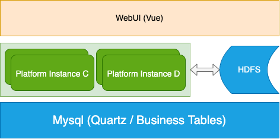

# flink-platform-web

> This project is a job scheduling framework with center less structure, easy to scale up.
> We can customize the workflow DAG and schedule it.

[preview video](https://user-images.githubusercontent.com/14097070/181010270-af6209f5-3c77-4743-bda0-672469524e7e.mov)

## Overview

1. [Quick Start](docs/startup.md)
2. [Configuration Details](docs/configuration.md)
3. [Architecture Design](docs/architecture.md)



- WebUI: Frontend files are in a separate project written in vue, please
  visit [flink-platform-frontend](https://github.com/itinycheng/flink-platform-frontend).
- Platform Instance: The instance for manage, configuration and scheduling workflow, easy to scale.
- HDFS: Used to store resource files, such as jar, udf, etc.
- Mysql: Holds all info about jobs, users, resources, schedules, etc. To keep the system simple, I
  plan to use mysql to guarantee fault-tolerance.

## Task Support

- Flink sql/jar, deployment mode: YARN-Per-Job(tested), Other(untested).
- Shell (tested).
- SQL(ClickHouse/Mysql/Hive/TiDB tested).
- Condition(tested, support: AND, OR).
- Dependent(tested).

- More: I don't have enough time to develop multi type task support, but implementing a new task
  type is easy, sometimes you can do it yourself or tell me your needs.

## Metadata

| Table Name     | Description                                                    |
|:---------------|:---------------------------------------------------------------|
| t_alert        | Alert configuration                                            |
| t_catalog_info | Flink catalog configuration for FlinkSQL, modify in the future |
| t_job          | Job info                                                       |
| t_job_flow     | Job flow info, workflow definition                             |
| t_job_flow_run | Job flow execution instance                                    |
| t_job_run      | Job execution instance                                         |
| t_resource     | Resources info, such as: jar, file, etc.                       |
| t_user         | login user info                                                |
| t_user_session | login user session info.                                       |
| t_worker       | Worker node instance info.                                     |
| t_datasource   | Store datasource info, such as: clickhouse, mysql, etc.        |

Refer to: [create table statements](docs/sql/schema.sql)

## Build and Run

```bash
# clone the project
git clone git@github.com:itinycheng/flink-platform-backend.git

# enter the project directory
cd flink-platform-backend

# compile
./mvnw clean package -DskipTests

# start within docker
docker-compose up -d --build
```

```bash
#!/bin/sh

# hadoop conf dir of the cluster where the job running on
export HADOOP_CONF_DIR=/data0/app/dw_hadoop/yarn-conf

# start project
nohup java -Xms4g -Xmx4g -jar -Dspring.profiles.active=dev flink-platform-web-0.0.1.jar >/dev/null 2>&1 &
```

## License

[Apache-2.0](LICENSE) license.
