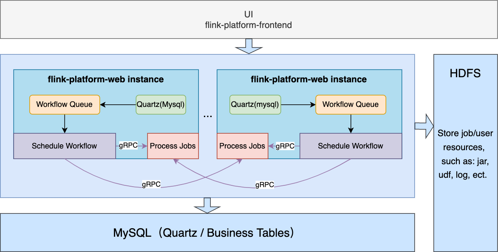

# Architecture

> The system is decentralized, all nodes are worker nodes.

## Architecture Description

### Scheduling Component

The entire scheduling component is based on Quartz(job-store = MySQL). Users set the scheduling cron
for workflows through the UI, Quartz triggers scheduling and add workflow to the PriorityQueue in
memory waiting for execution. Refer to the code in `com.flink.platform.web.quartz.JobFlowRunner`.

## Data storage

MySQL holds all info about jobs, users, resources, schedules, etc.  
HDFS holds resource files uploaded by users, in the future I will also store job logs to hdfs.

### Fault Tolerance

In order to keep the system simple, I'm not using components like zookeeper to guarantee system
fault tolerance. All instances of `flink-platform-web` communicate with MySQL, so I want to use
MySQL to complete system fault tolerance. Currently, You can restart/add `flink-platform-web`
instances arbitrarily, this won't affect the execution of workflows, the unfinished workflow will be
reloaded and executed after the `flink-platfrom-web` node restarted, refer to the code
in `com.flink.platform.web.service.InitJobFlowScheduler`.

For scaling operations, currently, you must migrate unfinished workflows to
other `flink-platform-web` instances (Change host ip in table: t_job_flow_run and restart the target
instance), I will implement auto migration rely on MySQL in the future.
