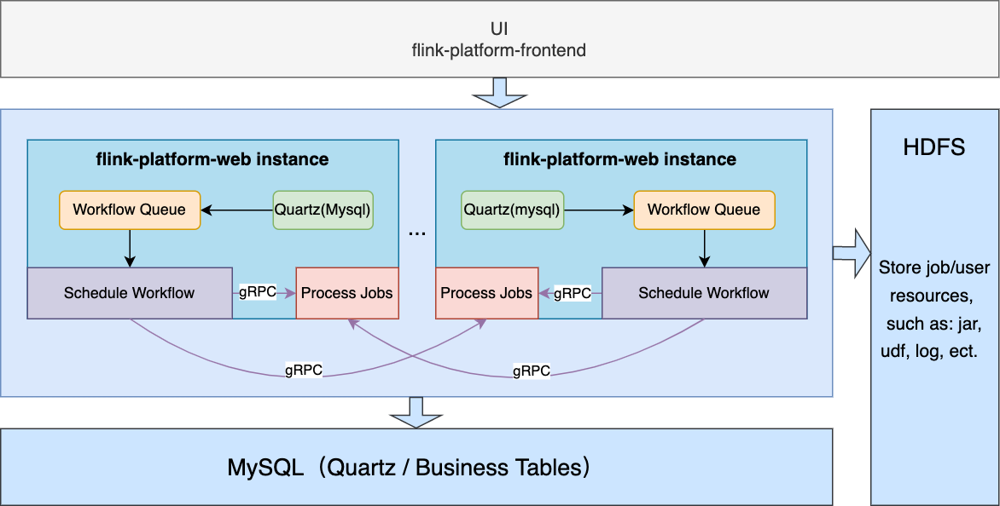

# Architecture

> The system is decentralized, all nodes are worker nodes.

## Architecture Description

### Scheduling Component

The entire scheduling component is based on Quartz(job-store = MySQL). Users set the scheduling cron
for workflows through the UI. When a trigger fires, `com.flink.platform.web.quartz.JobFlowRunner`
creates a `JobFlowRun` row (assigned to a worker via its `host` column) and persists it in a
non-terminal state — it is not handed to any in-memory queue. Each node's
`com.flink.platform.web.runner.FlowRunDispatcher.drainAndExecute` then polls MySQL every few seconds
for the non-terminal runs it owns (ordered by priority, bounded by free executor slots) and
dispatches each to a `FlowExecuteThread` for execution.

## Data storage

MySQL holds all info about jobs, users, resources, schedules, etc.  
HDFS holds resource files uploaded by users, in the future I will also store job logs to hdfs.

### Fault Tolerance

In order to keep the system simple, I'm not using components like zookeeper to guarantee system
fault tolerance. All instances of `flink-platform-web` communicate with MySQL, so I want to use
MySQL to complete system fault tolerance. Currently, You can restart/add `flink-platform-web`
instances arbitrarily, this won't affect the execution of workflows. The unfinished workflows owned
by a node are re-picked and resumed automatically after it restarts — `FlowRunDispatcher.drainAndExecute`
simply queries the non-terminal runs whose `host` is this node, so no dedicated reload step is needed.

When a node dies, its unfinished workflows are migrated automatically:
`com.flink.platform.web.lifecycle.WorkerHeartbeat.reassignOrphans` (guarded by ShedLock) detects
workers whose heartbeat has gone stale and rewrites the `host` of their non-terminal `t_job_flow_run`
rows to a healthy worker in the same workspace; that worker's `drainAndExecute` then picks the runs
up. If the old node is still alive, it notices the `host` no longer matches and abandons its local
orchestration, avoiding a double run. You can still migrate manually by changing `host`
in `t_job_flow_run`.
