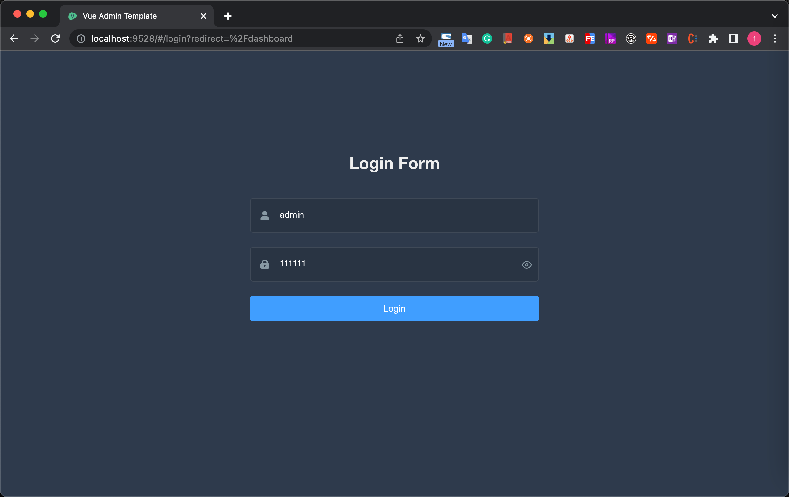
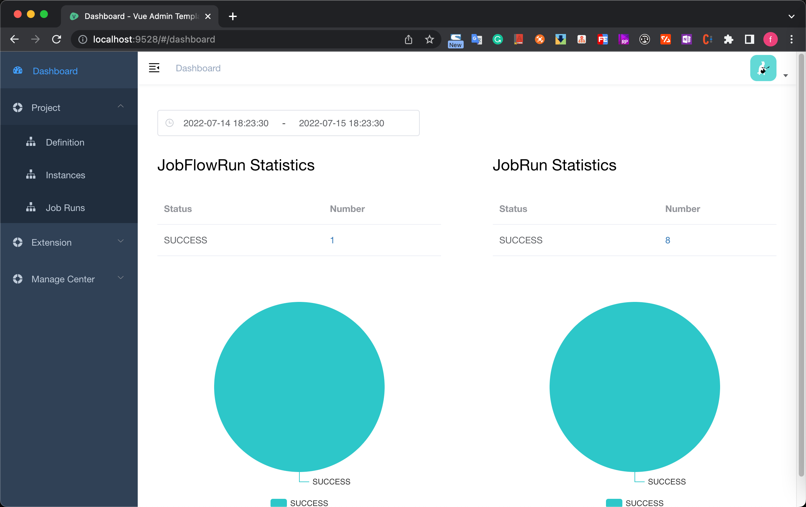

# Quick Start

1. Clone [frontend](https://github.com/itinycheng/flink-platform-frontend)
   , [backend](https://github.com/itinycheng/flink-platform-backend) projects and start frontend
   pages.

   ```bash
   # clone projects
   git clone https://github.com/itinycheng/flink-platform-backend.git
   git clone https://github.com/itinycheng/flink-platform-frontend.git

   # enter the frontend project directory
   cd flink-platform-frontend

   # install dependency
   npm install

   # start
   npm run dev
   ```

2. Install the mysql server and create the database and tables required for the project.  
   SQL file: [schema.sql](sql/schema.sql)

3. Modify the mysql info in the configuration
   file `flink-platform-web/src/main/resources/application-dev.yml`, the
   following mysql config should be modified to your actual configuration.

   ```yaml
   url: jdbc:mysql://0.0.0.0:3306/platform?allowMultiQueries=true&useUnicode=true&characterEncoding=UTF-8
   username: root
   password: 123456
   ```

4. Compile and start the backend project.
   You can start the project directly in your `IntelliJ IDEA` by running the main method
   of `PlatformWebApplication` or from the command line with command as shown bellow:

   ```bash
   cd flink-platform-backend
   mvn clean package -DskipTests

   cd flink-platform-web/target
   nohup java -Xms4g -Xmx4g -jar -Dspring.profiles.active=dev flink-platform-web-0.0.1.jar >/dev/null 2>&1 &
   ```

5. Now, both frontend and backend are started.  
   Address link: [http://localhost:9528/#/dashboard](http://localhost:9528/#/dashboard)  
   Username and password: admin/111111
   
   

End：These steps only described how to start the project, you can currently define a workflow, but if
you want to schedule it you also need to set up extra configurations, such as hadoop environment,
datasource, etc.
